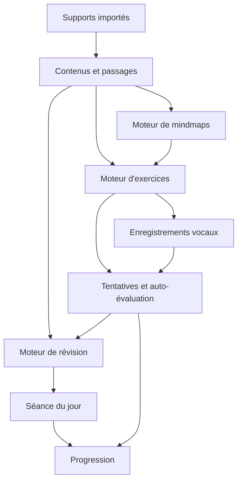

# Architecture fonctionnelle de Sirāfiq

## 1. Principe directeur

Sirāfiq est un **moteur d’apprentissage personnel, local et hors ligne**. L’application ne doit pas être une collection d’écrans indépendants : chaque contenu importé alimente un parcours cohérent reliant source, passages, exercices, enregistrements, cartes mentales, révisions et progression.

Le texte original est une source verrouillée. Toute structure dérivée reste reliée à un extrait exact et ne remplace jamais la source.

## 2. Architecture en couches

### Couche 1 — Sources

Gère l’import et la conservation locale des supports :

- texte saisi ou collé ;
- fichiers texte ;
- PDF ;
- images ;
- audios de référence.

Chaque source reçoit une empreinte locale, un nom, un type, une date d’import et un état de conservation.

### Couche 2 — Contenus et passages

Un contenu regroupe une source et ses unités d’apprentissage. Un passage possède :

- un extrait exact ;
- une position dans la source ;
- un titre utilisateur ;
- une langue et une direction d’écriture ;
- un état de maîtrise ;
- des objectifs facultatifs.

### Couche 3 — Moteur de révision

Le moteur sélectionne les éléments de la séance du jour selon :

1. éléments urgents ou fragiles ;
2. maintien des éléments consolidés ou maîtrisés ;
3. poursuite du contenu en cours ;
4. nouveau contenu si la charge le permet ;
5. prononciation et écriture.

Chaque proposition doit afficher une raison compréhensible.

### Couche 4 — Moteur d’exercices

Exercices retenus :

- lecture fragmentée ;
- masquage progressif ;
- révélation ciblée ;
- restitution sans texte ;
- restitution vocale ;
- écoute et répétition ;
- lecture rythmée ;
- démonstration et tracé guidé ;
- entraînement de régularité.

Exercices exclus :

- textes à trous ;
- remise en ordre de fragments.

### Couche 5 — Moteur vocal

Gère :

- autorisation du microphone ;
- enregistrement ;
- pause et reprise ;
- lecture ;
- conservation locale ;
- renommage ;
- note ;
- favori ;
- comparaison de deux tentatives ;
- suppression après confirmation.

Aucun fichier vocal ne peut être supprimé automatiquement.

### Couche 6 — Moteur de mindmaps

Une mindmap est une vue structurée reliée aux sources. Elle peut être créée :

- depuis tout un texte ;
- depuis un passage sélectionné ;
- manuellement.

Elle doit proposer :

- zoom et déplacement tactile ;
- branches repliables ;
- mode focus ;
- apparition progressive ;
- lien vers l’extrait source ;
- lien vers les exercices et vocaux associés ;
- statut de maîtrise par nœud.

### Couche 7 — Progression

La progression ne se limite pas à un score. Elle présente :

- ce qui a été revu ;
- les éléments devenus plus stables ;
- les difficultés persistantes ;
- l’évolution des révélations utilisées ;
- l’évolution des tentatives vocales ;
- la régularité des séances.

## 3. Deux modes de navigation

### Mode classique

Accès direct aux cinq horizons :

- Accueil ;
- Mémoriser ;
- Prononcer ;
- Écrire ;
- Progrès.

### Mode exploration

Vue globale des connaissances sous forme de carte mentale. Elle permet de naviguer entre contenus, passages, notions, exercices, vocaux et états de maîtrise.

Le mode exploration complète le mode classique ; il ne le remplace pas.

## 4. Contraintes non négociables

- fonctionnement local prioritaire ;
- aucune création de compte ;
- aucune collecte de données ;
- aucune suppression automatique ;
- aucune modification silencieuse du texte original ;
- aucune interprétation automatique des passages coraniques ;
- compatibilité tactile, stylet tiers et doigt ;
- interface utilisable avec réduction des animations ;
- sauvegarde et restauration manuelles.

## 5. Frontières de la V1

La V1 doit prouver les parcours fondamentaux avant d’ajouter des fonctions secondaires :

1. importer un support ;
2. créer un passage ;
3. générer ou construire une mindmap ;
4. démarrer une séance ;
5. réaliser un exercice ;
6. enregistrer et réécouter un vocal ;
7. fermer puis rouvrir sans perte ;
8. exporter puis restaurer une sauvegarde.

Une fonction n’est considérée comme terminée que lorsque ce parcours fonctionne sur Safari iPad et iPhone.
