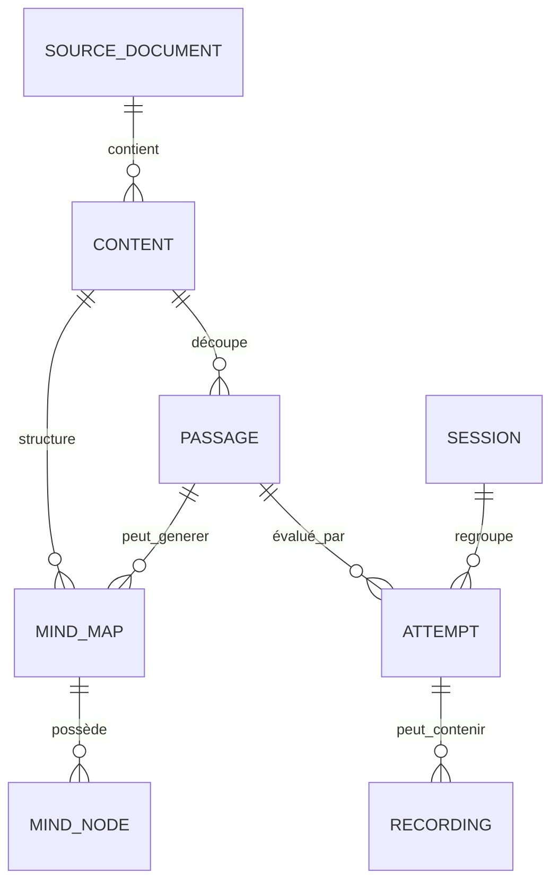

# Modèle de données local

## Objectif

Les données sont stockées localement dans IndexedDB. Le modèle sépare les fichiers binaires, les textes, les structures pédagogiques et l’historique des tentatives afin d’éviter les pertes et de faciliter les sauvegardes.

## Entités principales

### `sourceDocuments`

Support importé.

| Champ | Rôle |
|---|---|
| `id` | identifiant local stable |
| `name` | nom affiché |
| `mimeType` | type du fichier |
| `kind` | text, pdf, image, audio |
| `blobId` | référence vers le fichier binaire |
| `textContent` | texte extrait ou saisi, sans modification |
| `createdAt` | date d’import |
| `checksum` | détection des doublons |
| `locked` | verrouillage de la source |

### `blobs`

Fichiers binaires volumineux.

| Champ | Rôle |
|---|---|
| `id` | identifiant local |
| `blob` | contenu binaire |
| `size` | taille en octets |
| `createdAt` | date de création |

### `contents`

Unité éditoriale principale.

| Champ | Rôle |
|---|---|
| `id` | identifiant |
| `sourceDocumentId` | support d’origine |
| `title` | titre utilisateur |
| `category` | mémorisation, Coran, prononciation, écriture |
| `language` | français ou arabe |
| `direction` | ltr ou rtl |
| `createdAt` | date de création |
| `archived` | retrait sans suppression |

### `passages`

Extraits d’apprentissage exacts.

| Champ | Rôle |
|---|---|
| `id` | identifiant |
| `contentId` | contenu parent |
| `sourceStart` | position initiale dans la source |
| `sourceEnd` | position finale |
| `exactText` | copie exacte vérifiable |
| `title` | titre utilisateur |
| `masteryState` | learning, fragile, consolidated, mastered |
| `manualPriority` | priorité facultative |
| `lastReviewedAt` | dernière révision |
| `nextReviewAt` | prochaine révision |

### `mindMaps`

Carte mentale d’un texte ou d’un passage.

| Champ | Rôle |
|---|---|
| `id` | identifiant |
| `contentId` | contenu parent |
| `passageId` | passage facultatif |
| `title` | titre de la carte |
| `generationMode` | structured, assisted-draft, manual |
| `validated` | validation utilisateur |
| `viewport` | zoom et position |
| `createdAt` | date de création |

### `mindNodes`

Nœud d’une carte mentale.

| Champ | Rôle |
|---|---|
| `id` | identifiant |
| `mindMapId` | carte parent |
| `parentId` | nœud parent |
| `label` | intitulé affiché |
| `sourceStart` | début de l’extrait lié |
| `sourceEnd` | fin de l’extrait lié |
| `sourceQuote` | extrait exact |
| `positionX` / `positionY` | position manuelle |
| `collapsed` | branche repliée |
| `masteryState` | état local du nœud |
| `userValidated` | validation explicite |

### `sessions`

Séance planifiée ou commencée.

| Champ | Rôle |
|---|---|
| `id` | identifiant |
| `dateKey` | jour local |
| `status` | prepared, active, paused, completed |
| `items` | ordre des activités |
| `currentIndex` | reprise exacte |
| `startedAt` | début |
| `completedAt` | fin |

### `attempts`

Résultat d’un exercice.

| Champ | Rôle |
|---|---|
| `id` | identifiant |
| `sessionId` | séance associée |
| `passageId` | passage associé |
| `exerciseType` | type d’exercice |
| `revealsUsed` | nombre de révélations |
| `selfRating` | évaluation utilisateur |
| `errors` | erreurs marquées |
| `hesitations` | hésitations marquées |
| `durationMs` | durée |
| `createdAt` | date |

### `recordings`

Enregistrement vocal local.

| Champ | Rôle |
|---|---|
| `id` | identifiant |
| `blobId` | fichier audio |
| `passageId` | passage associé |
| `attemptId` | tentative associée |
| `title` | nom modifiable |
| `note` | note facultative |
| `favorite` | favori |
| `durationMs` | durée |
| `mimeType` | format audio |
| `createdAt` | date |

### `writingTraces`

Tracés d’écriture.

| Champ | Rôle |
|---|---|
| `id` | identifiant |
| `exerciseId` | exercice associé |
| `strokes` | liste de points vectoriels |
| `inputType` | stylus, touch, mouse |
| `createdAt` | date |

### `settings`

Réglages locaux : animations réduites, rappels, préférences audio, sens de lecture, seuils de stockage et options de sauvegarde.

## Relations importantes

## Versions et migrations

Chaque version de la base doit avoir un numéro. Une migration doit :

- préserver les enregistrements existants ;
- être testée sur une copie de sauvegarde ;
- ne jamais effacer une table sans confirmation explicite ;
- laisser une trace dans le journal local de migration.
